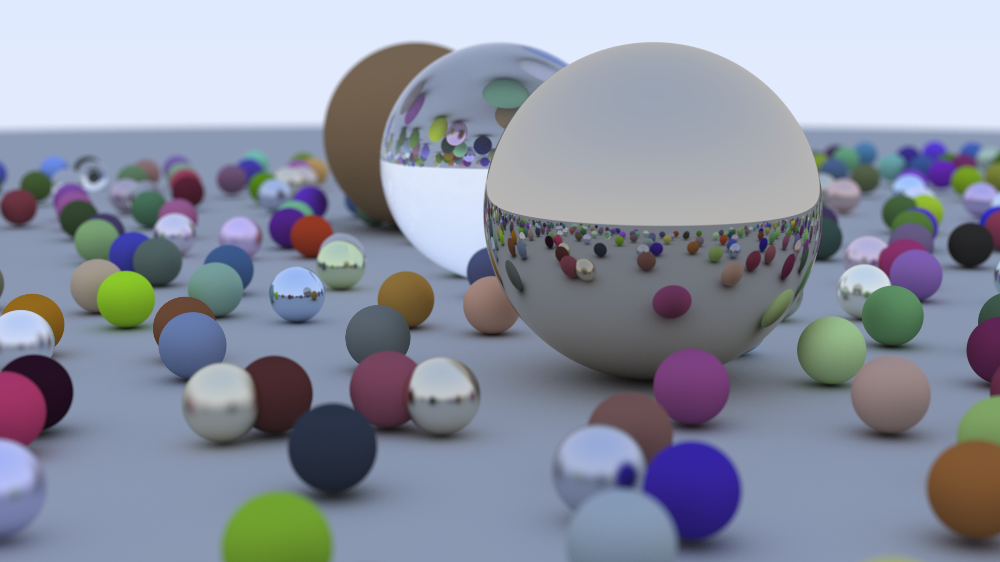

# in a Weekend

## [python](in_a_Weekend/python/README.md)

### notes
* run with PyPy for better performance
* returning result in `hit()`, `scatter()` etc. instead of updating arguments improves performance

### benchmarks
* i7-6700K @ 4G x 8

width | height | samples/pixel | bounces | time | workers
--- | --- | --- | --- | --- | ---
200 | 100 | 100 | 50 | 47s | 1
200 | 100 | 100 | 10 | 45s | 1
200 | 100 | 100 | 10 | 24s | 2
200 | 100 | 100 | 10 | 15s | 4
200 | 100 | 100 | 10 | 19s | 8

## [rust](in_a_Weekend/rust/README.md)

### notes
* run in release mode for better performance
* used `Box<T>` to put trait objects in `vec`. TODO: `Rc<T>` should also work
* used `?` as a shortcut of `unwrap()`
* lifetime specifier needed for references in structs
* `Sync` trait needed for parallelism with rayon

### benchmarks
* i7-6700K @ 4G x 8

width | height | samples/pixel | bounces | time | workers
--- | --- | --- | --- | --- | ---
200 | 100 | 100 | 10 | 10s | 1
200 | 100 | 100 | 10 | 2s | 8
1200 | 800 | 10 | 10 | 140s | 8

