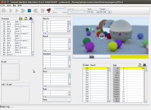

# A Simple Ray Tracer in Jack

## Screenshot


## Usage

A [modified](https://github.com/qszhu/nand2tetris-emu) VMEmulator that supports colored pixels is included.

* start VMEmulator
```
$ cd emu
$ java -jar VMEmulator-2.6.2-SNAPSHOT.jar
```
* load folder `vm`

## Notes
* The modified emulator has a resolution of 128x64 pixels. Each pixel is a RGB565 value (16 bit). Hence the total size of the video memory stays the same
* It would take **several days** to render the final scene. Reduce the output and sample size in `Main.jack` to speed up a little bit
* `Float.jack` and `LFSR32Rand.jack` are taken from the nand2tetris forum

## Reflections
* Software implementation of float is slow. A natural next step is to add hardware floating point support
* Manual management of memory is tedious and error-prone. Have fixed various memory leaks/double disposes along the way. A scope-based memory management could be useful here
* Lack of inheritance and polymorphism make it hard to follow the open closed principle
